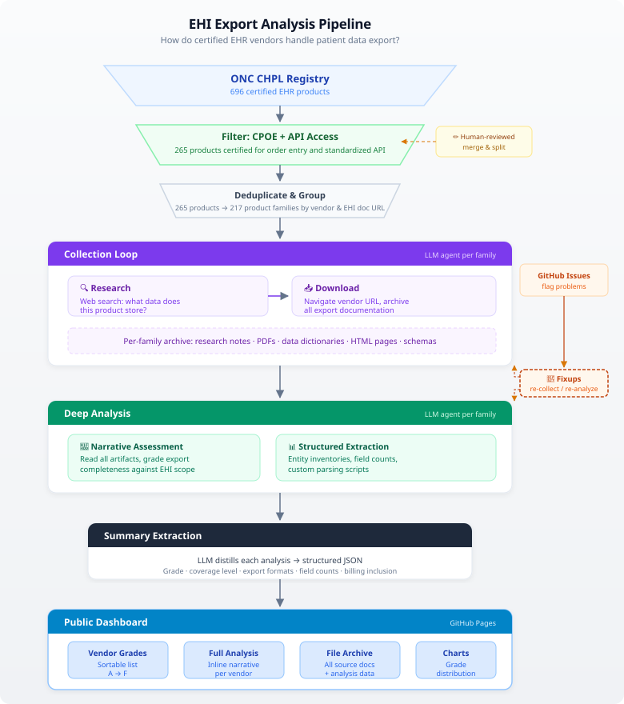

# What 217 Certified EHRs Actually Export

Under the [21st Century Cures Act](https://www.congress.gov/bill/114th-congress/house-bill/34/text/pl) and [its implementing regulations from HHS](https://www.healthit.gov/topic/laws-regulation-and-policy/health-it-legislation-and-regulations), every certified EHR must be able to export **all** of a patient's electronic health information — the full [§170.315(b)(10)](https://www.healthit.gov/test-method/electronic-health-information-export) requirement. Not a clinical summary. Not the USCDI floor. Everything, in a computable format, with published documentation describing what it contains.

Over 600 certified health IT products attest to (b)(10). Many of those are narrow-scope modules — a standalone patient portal, a quality measure calculation engine, an API adapter. To focus on products that function as fairly complete EHRs, I filtered for those also certified for CPOE [(a)(1)–(a)(3)](https://www.healthit.gov/test-method/computerized-provider-order-entry-cpoe-medications) and the standardized FHIR API [(g)(10)](https://www.healthit.gov/test-method/standardized-api-patient-and-population-services) — a rough proxy for a typical clinical capability set. That leaves 217 product families. I downloaded whatever each vendor published at their CHPL-registered documentation URL, examined what it describes, and graded it.

The results are not good.

## Why this matters more than it used to

Clinical summaries have always been lossy by design. A C-CDA or FHIR US Core document captures the highlights — the problem list, the med list, the recent labs. That's genuinely useful for provider-to-provider handoffs and population health queries. But the use cases emerging now need more than highlights.

Consider an AI agent helping a patient navigate a complex cancer diagnosis. It needs the oncology staging data, the chemo regimen details, the radiation treatment plans — not just "Condition: malignant neoplasm of breast" on a problem list. A patient transitioning between behavioral health providers needs their PHQ-9 score trajectories, psychosocial assessments, and treatment plan history — concepts that C-CDA can't even represent. A patient trying to understand a surprise medical bill needs the actual charge detail, claim submissions, and denial history — data that has no representation in any standard clinical exchange format.

These use cases all build on the same legal foundation: the patient's right under HIPAA to access their [Designated Record Set](https://www.ecfr.gov/current/title-45/subtitle-A/subchapter-C/part-164/subpart-E/section-164.501), which (b)(10) requires certified EHRs to export in computable form. The regulation was written before the current AI moment, but it's exactly the pipe that needs to work for AI agents, personal health applications, and other downstream consumers to build on a patient's right to access their *whole* record — not just the summary.

So: does it?

## What we did

Every product certified for (b)(10) registers a URL on the [CHPL](https://chpl.healthit.gov/) where its export format documentation lives. Starting from the CPOE + (g)(10) filter described above, we grouped the resulting 265 CHPL-certified products into 216 product families. (Products sharing an EHI documentation URL and developer are one family — MEDITECH Expanse 2.1 and 2.2 are a single family; MEDITECH Expanse and MEDITECH Client/Server are different families because they have different export architectures.)

*The full pipeline: CHPL registry → filter and deduplicate → phased collection → deep analysis → structured summary → public dashboard.*

For each family, an AI agent researched the vendor and product, then navigated to the registered documentation URL and downloaded everything it found — PDFs, HTML pages, data dictionaries, schema files. A separate agent then performed a deep analysis: what does the export actually contain? How does it compare to what the product stores? Is this a genuine EHI export or a relabeled clinical summary?

Everything is open source. The [dashboard](https://jmandel-bot.github.io/ehi-export-analysis/) has the full results; the [repository](https://github.com/jmandel-bot/ehi-export-analysis) has the methodology, prompts, and raw data.

## 217 products, graded

| Grade | Count | What it means |
|-------|-------|---------------|
| A / A- | 28 (13%) | Purpose-built, comprehensive, documented |
| B+ / B / B- | 35 (16%) | Real effort, notable gaps |
| C+ / C / C- | 36 (17%) | Partial — some substance, significant holes |
| D+ / D / D- | 104 (48%) | Minimal or stub |
| F | 14 (6%) | Nothing meaningful |

Over half of the EHR products analyzed — products certified by ONC, attesting to a federal requirement, serving real patients — have (b)(10) export documentation that either describes what amounts to a clinical summary relabeled as "all EHI" or is too thin to evaluate at all.

The most common single grade is a plain D, at 58 products (27%). These are the textbook cases: a C-CDA clinical summary or (g)(10) FHIR API relabeled as the (b)(10) export, with no data dictionary, no specialty data, and usually no billing.

## Billing as litmus test

Almost every EHR in this cohort handles billing — charge capture, claim submission, payment posting, denial management. Billing data is squarely part of the Designated Record Set. And it has no representation in C-CDA or USCDI: there's no C-CDA template for a superbill, no US Core profile for a claim denial.

So billing is a natural litmus test. If a vendor's export includes billing data, they built something beyond their existing clinical exchange infrastructure. If it doesn't, they probably relabeled what they already had.

Among products graded B or above: **94%** include billing. Among products graded D or F: **7%**.

I don't want to overread this — the grading rubric rewards comprehensiveness, and billing is one marker of comprehensiveness. But billing is the most *observable* signal. You don't need to parse a data dictionary to check whether billing tables exist in the export. And the dichotomy is stark: vendors either took billing seriously or ignored it entirely.

### When vendors export billing, they export *a lot*

Billing often turns out to be the single largest domain in the entire export:

- **Epic** exports 1,286 billing and revenue cycle tables with 12,367 columns. This single domain exceeds most vendors' *entire* exports.
- **Altera Sunrise** dedicates 917 tables to billing — 33% of everything in the export.
- **Greenway Prime Suite** includes 192 billing tables. Their `CFBClaimInfo` table has 435 fields — the single largest entity in the export.
- **eClinicalWorks** exports 161 billing tables, including state-specific Medicaid claim forms: a NY Workers' Comp C-4.3 at 218 fields, a UB-04 institutional claim at 127 fields.
- **Juno Health**: the three largest tables in the entire export are all billing. `RCMUB04CLAIM` (260 fields mapping every box on the UB-04 form), `RCM1500CLAIM` (116 fields), `BILLINGITEM` (115 fields).

Smaller vendors get this right too. MDVita (24 entities total) is a claims-adjudication company turned EHR vendor — their `Claims` entity has 85 fields with granular EOB data. athenahealth invented 9 custom FHIR resource types specifically for billing — 506 fields including charges, collections, eligibility, and payment plans — proving you can do this in FHIR if you actually do the mapping work.

### And when they don't

Sometimes the irony is hard to miss:

- **MaxRemind (Maximus EHR)**: a billing company's EHR. Export: repackaged (g)(10) FHIR plus two undocumented Excel files. Zero billing data.
- **ClaimPower**: the company name says it. Export: C-CDA clinical summary, 502 words of screenshot walkthroughs. Zero claims or payment data.
- **Radysans**: full eBilling module with 2,500+ payer connections. Export: one-page doc listing C-CDA sections.
- **Vohra Wound Physicians**: the company name includes "Coding." Billing data entirely absent from the export.

## Specialty EHRs and their specialty data

Specialty EHRs are where the stakes are clearest. These products exist to capture domain-specific clinical data — and some vendors export it beautifully.

**ModMed's gGastro** (GI/endoscopy) exports 441 tables with 4,453 fields — including a `Finding` table with 155 fields per endoscopic finding (polyp size, morphology, location, removal method), 115 billing tables, and 1,166 value sets. **ModMed's EMA** (ophthalmology) exports 25 ophthalmology pretesting tables with 1,209 fields — visual acuity (93 fields), refraction (82), keratometry, IOP, pachymetry.

**nAbleMD** (fertility/IVF) exports 31 IVF-specific entities with 1,317 fields, including `emrcycle` at 231 fields per treatment cycle. **Flatiron OncoEMR** exports chemo dose calculations, AJCC staging, treatment pathways, and lifetime cumulative doses. These vendors looked at what their products actually store and built exports that cover it.

Then there are their competitors in the same specialties.

**EndoVault** (also endoscopy/GI): stores HD images, 4K video, bowel prep scores, polyp characteristics, scope tracking via RFID. The export: zero endoscopy data. The 138-page "EHI" documentation is the (g)(10) FHIR API spec relabeled — 18 standard FHIR resources, identical to any generic EHR.

**EyeMD** (also ophthalmology): 2024 Best in KLAS winner. Integrates Zeiss, Heidelberg, and Topcon imaging devices. Export: 25 standard FHIR resources, zero ophthalmology data. Their mandatory disclosures describe (b)(10) as "Ability to send CCDA information to other systems via secure transmission" — literally conflating EHI export with transitions of care.

**OMS EHR** (cardiology): claims "6,000+ data points per patient" across 16 cardiovascular modules including echo, EKG, cath lab, and stress testing. The entire EHI documentation: a 9-row, 2-column table on a single page. Zero fields defined.

**TheraOffice** (PT/OT/SLP, Netsmart): serves 900+ rehab practices. 16 of 19 export tables are named `PAT_PROFILE_USCDI_*` — the clearest possible confession that this is USCDI relabeled as EHI. Zero therapy evaluations, zero outcome measures, no LEFS, no DASH, no NDI, no Oswestry.

**ARIA CORE** (radiation oncology, Varian/Siemens): the dominant US radiation oncology system. Registered EHI documentation URL returns 404. It has never been captured by the Wayback Machine.

**InPracSys** (urology): "Built by urologists, for urologists." Export: 15 standard FHIR resources, 328 fields. Zero urology data.

The specialty data exists in all of these systems — it's what they're built to capture. The difference is whether the vendor did the work.

## Behavioral health

Behavioral health deserves specific attention. These products handle some of the most sensitive clinical data — psychosocial assessments, suicide risk screenings, substance use treatment records, psychiatric treatment plans. Most of this data has no C-CDA representation. And behavioral health records carry additional privacy protections under [42 CFR Part 2](https://www.ecfr.gov/current/title-42/chapter-I/subchapter-A/part-2) that make portability *more* important, not less — patients need to be able to verify what their providers have on file.

The pattern is consistent: a handful of behavioral health EHRs did it well, and the rest ship generic C-CDA with zero behavioral health content.

Qualifacts' **CareLogic** (A-, 671 entities, 8,441 fields) and **Credible** (A-, 106 entities, 1,993 fields) both export deep behavioral health data structures. **HCS EMR** (A-, 339 entities) does the same. These products prove that comprehensive BH exports are feasible.

Then there's the rest. **Streamline SmartCare** (Netsmart) is an EHR built specifically for community behavioral health and human services. Its export has "nothing behavioral-health-specific" — no treatment plans with the "golden thread" linking diagnosis to interventions, no BH progress notes, no screening tools (PHQ-9, AUDIT, DAST), no substance use disorder treatment records, no case management. The export covers standard clinical domains only — roughly 10–15% of what the product stores.

The same pattern repeats across **CarePaths** (D), **Core Solutions** (D), **Ehana** (D), **Foothold** (D). Each is a purpose-built behavioral health platform. Each exports a generic clinical summary.

## Portal messages aren't in your record

Of the 193 products where we could assess patient communications, 123 (64%) exclude them entirely. Only 70 (36%) include them fully or partially.

This is data that patients generated — messages sent to their doctors, responses received, portal interactions. It's unambiguously part of the Designated Record Set. Even among well-graded products, it's a common gap: **Netsmart myEvolv** (A-, 1,565 entities) and **PointClickCare** (A-, 48 entities) both exclude patient communications despite otherwise strong exports.

## What serious looks like

Twenty-eight product families earned an A or A-. They span from the largest EHR vendors to solo developers:

- **Oracle Health (Millennium)**: 6,853 tables, 130,853 columns, 99.9% description coverage, three complementary export pathways. The gold standard for documentation depth.
- **Epic**: 7,672 tables, 63,121 columns, 100% descriptions. The Clarity data model exported as TSV with full field documentation.
- **eClinicalWorks**: 1,466 tables, 21,143 fields. Billing at 161 tables, clinical at 350+.
- **Greenway Prime Suite**: 1,026 tables, 11,868 fields.
- **athenahealth**: a purpose-built FHIR export with 9 custom financial resource types — proving you can do this in FHIR if you invest in the mapping.
- **Crystal Practice Management** (ABEO, 80 entities): a small ENT vendor with a 921-page data dictionary. 58 tables covering clinical, billing, VSP insurance, and ophthalmology supply chain. Size doesn't determine effort.
- **OpenEMR**: 322 entities, 4,941 fields. Community-maintained, open-source, and more thoroughly documented than most commercial vendors.

The point isn't that every product needs 7,000 tables. The point is that if a product has 10,000 fields in its data model — fields informing the UI, driving clinical decision support, populating specialty workflows — and the export offers 300 of them wrapped in a standard C-CDA, that's not a comprehensive export. The vendors above looked at what their products actually store and built exports that cover it. That's what the regulation requires.

## Back to the pipe

The (b)(10) requirement is the regulatory infrastructure for a patient's right to get their full record in computable form. As AI capabilities expand — cancer navigation, behavioral health transitions, billing dispute resolution, longitudinal health monitoring — the value of that full record grows with them. Clinical summaries are a fine starting point, but they are not the ceiling.

For the 29% of products graded A or B, the pipe works. These vendors have built exports that could meaningfully support downstream AI applications, patient data portability, and independent analysis.

For the 54% graded D or F, the pipe is broken. The export describes a clinical summary — sometimes literally the same C-CDA used for transitions of care — relabeled as "all EHI." A patient at one of these systems can request an export and receive roughly the same data they'd get from the Blue Button download on their patient portal. The billing data, the specialty clinical data, the messages, the administrative records — everything that makes the EHR *the EHR* — isn't in the box.

The gap between what the regulation requires and what the industry delivers is large, and it's measurable.

## So now what

A few observations, not prescriptions:

**ONC could require actual testing.** Today, (b)(10) conformance is attestation-based — vendors attest, ONC-ACBs review the attestation, but nobody runs a test export and checks what comes out. The extreme variability in what vendors publish at their documentation URLs suggests attestation alone isn't producing consistent outcomes.

**ONC-ACBs could examine the documentation.** The published documentation is public. When a vendor's entire (b)(10) spec is a link to the generic HL7 C-CDA implementation guide, that's visible to anyone who looks — including the body that certified the product.

**Patients and advocates can ask informed questions.** The [dashboard](https://jmandel-bot.github.io/ehi-export-analysis/) is public. If your EHR is graded D and you're requesting your records, you now have specific language for what's missing.

**Developers building on patient access rights should calibrate expectations.** The theoretical right to a complete computable export and the practical implementation diverge sharply. Plan accordingly.

---

The [full results and per-vendor analyses](https://jmandel-bot.github.io/ehi-export-analysis/) are public and will continue to be updated as we complete Phase 2 (107 additional product families with CPOE but no FHIR API) and Phase 3 (remaining certified products). The [methodology, prompts, and source data](https://github.com/jmandel-bot/ehi-export-analysis) are open source.

*Analysis by [Josh Mandel, MD](https://www.linkedin.com/in/joshuamandel/). Assessments are AI-assisted and may contain errors — [please report corrections](https://github.com/jmandel-bot/ehi-export-analysis/issues/new).*
